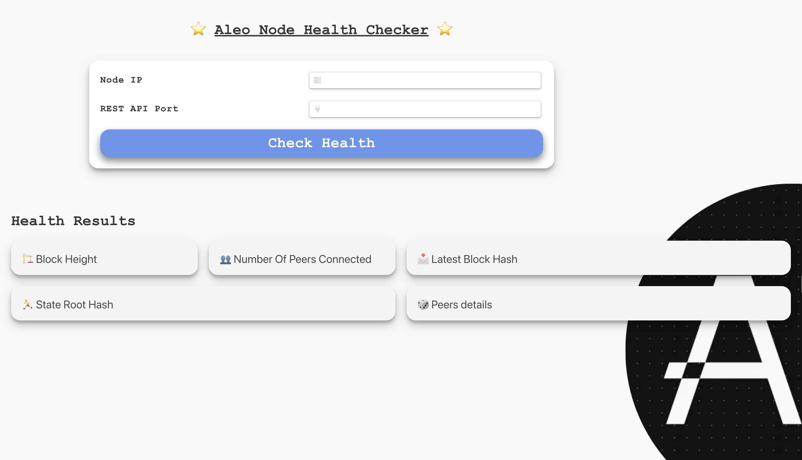
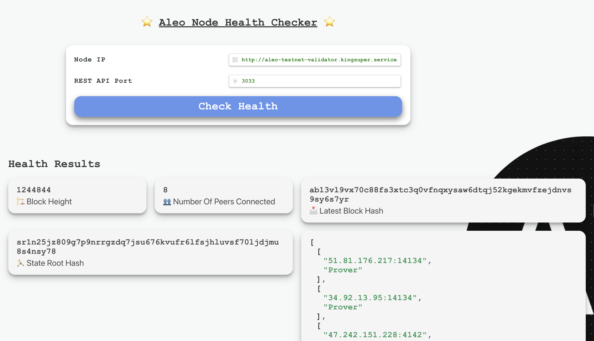

# Aleo Node Checker

## Run the Application
To start using the Aleo Node Checker, simply follow these steps:
```bash
npm install
npm run start
```

# Overview and Features

The Aleo Node Checker is a versatile and user-friendly tool designed to assess the health and status of any Aleo Node. Here are its key features:

- **Node IP and REST API Port**: These fields enable users to connect to any Aleo Node by entering its IP address and REST API port number. This flexibility is crucial for a tool that's meant to service various nodes across the network.

- **Block Height**: Displayed in the health results, this important metric informs users about the current block height of the node, indicating whether the node is synchronized with the latest blockchain data.

- **Number Of Peers Connected**: This metric, also part of the health results, shows the number of peers connected to the node. A higher number suggests better connectivity and reliability in the network.

- **Latest Block Hash**: This result provides the hash of the most recent block processed by the node, offering an additional layer of verification and insight into the node's current state.

- **State Root Hash**: Representing the current state of the node, this hash is a crucial piece of information for understanding the node's integrity and consistency with the blockchain.

- **Peers Details**: This feature provides detailed information about each peer connected to the node, offering insights into the node's network environment and its interactions with other nodes.

The Aleo Node Checker is a valuable tool for node operators and network participants. It offers a comprehensive view of a node's health and status, assisting in monitoring, maintenance, and troubleshooting. Its intuitive design and detailed reporting make it an essential tool for anyone involved in the Aleo network.


